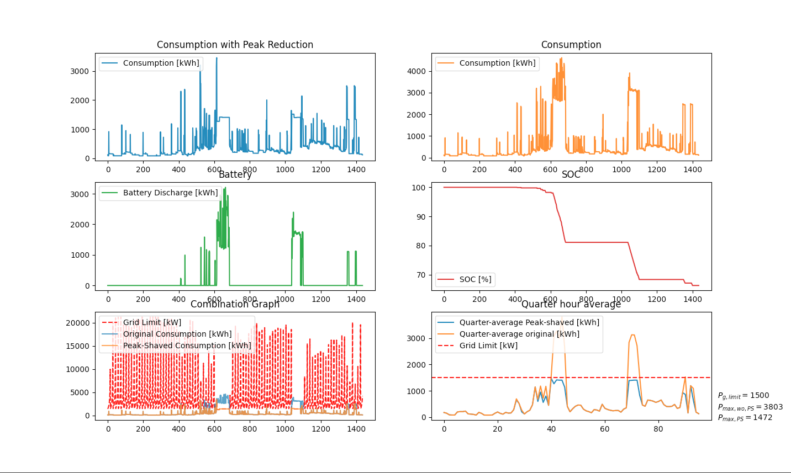

# Control Strategy development

## Peak reduction:

Dynamic peak shaving limit determination using specific time window average.

Tested on a historical dataset within a timerange of 2022-02-26T00:01:00Z to 2022-02-27T00:00:00Z, data is drawn from a household in Zwevegem, Belgium. This logic will be converted into an object-oriented Golang library.

As a matter of precaution, the logic chooses to already peak-shave when Pl > Pg,limit on the first timestep of each timewindow. Because it is uncertain whether a high peak will occur within that time window which cannot be handled by the battery due to the max power output restrictions. By doing so, the limit does not need to be lower than the initial limit.

### Schematic

### Dynamic peak shaving limit determination using specific time window average formula

### Results

The graph on the bottom right shows that the average quarterly peak has been reduced to a maximum of 1500 kW. There is no hard limit to 1500 kW which would cause too much unnecessary peakshaving to occur. For each time step, the system calculates the limit of peak reduction required to reach a target maximum peak within a given time window (in our case, fifteen minutes). This allows the peak to be optimally reduced.

## Arbitrage

Basic control for charging and discharging a battery. Charging is done in function of the produced energy of the PV-installation. Discharging occurs as soon as $P_l$ > $P_pv$.

Tested on a historical dataset within a timerange of 2022-02-26T00:01:00Z to 2022-02-27T00:00:00Z, data is drawn from a household in Zwevegem, Belgium. This logic will be converted into an object-oriented Golang library.

### Charging

### Discharging

### Results

## Combination peak-shaving and arbitrage

