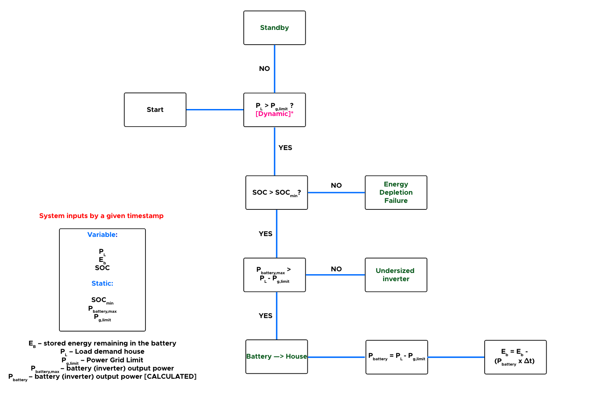

# Control Strategy development

## Peak reduction:

Dynamic peak shaving limit determination using specific time window average.

Tested on a historical dataset within a timerange of 2022-02-26T00:00:00Z to 2022-02-27T23:59:00Z, data is drawn from a household in Zwevegem, Belgium. This logic will be converted into an object-oriented Golang library.

As a matter of precaution, the logic chooses to already peak-shave when $P_l$ > $P_g$,limit on the first timestep of each timewindow. Because it is uncertain whether a high peak will occur within that time window which cannot be handled by the battery due to the max power output restrictions. By doing so, the limit does not need to be lower than the initial limit.

### Schematic

### Dynamic peak shaving limit determination using specific time window average formula

This formula will be applied to calculate the $n$ next steps in a time window, thus setting the shaving limit in such a way that per time window the target is not exceeded - dynamic peak shaving limit determination using specific time window average.

### Results: Python

The graph on the bottom right shows that the average quarterly peak has been reduced to a maximum of 1500 kW. There is no hard limit to 1500 kW which would cause too much unnecessary peakshaving to occur. For each time step, the system calculates the limit of peak reduction required to reach a target maximum peak within a given time window (in our case, fifteen minutes). This allows the peak to be optimally reduced. 

### Results: Dynamic Library Golang

In order to develop a scalable product, it was decided to develop a fully object-oriented Golang Library in addition to the python test environment to ensure quality, scalability and responsiveness. 

This library was tested using 7 days of data at the end of February 2022. Data is drawn from a household in Zwevegem, Belgium. This logic will be converted into an object-oriented Golang library.

This library accomplishes practically the same task as the python environment but allows you to modify or add controls in a more convenient way. Which is a must to be able to easily adjust possible bugs or errors in the controller during the testing phase.

The graph below also shows a feature that has not yet been added in the python test environment. Namely danymic peak target selection. If for some reason (battery depleted, too high consumption causing the battery to be unable to handle the peak) a quarter peak cannot be lowered to the target, the remaining days of that month will have the target raised to that peak. This is because the customer will already be paying this peak, of course it remains desirable to peakshave at that limit, preventing the further increase of the cost. This occurance can be observed between 02/27 and 02/28.

## Arbitrage

Basic control for charging and discharging a battery. Charging is done in function of the produced energy of the PV-installation. Discharging occurs as soon as $P_l$ > $P_pv$.

Tested on a historical dataset within a timerange of 2022-02-26T00:01:00Z to 2022-02-27T00:00:00Z, data is drawn from a household in Zwevegem, Belgium. This logic will be converted into an object-oriented Golang library.

### Charging

### Discharging

### Results

## Combination peak-shaving and arbitrage

